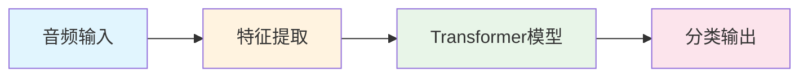

# CryDet 项目文档

本文档目录包含 CryDet（婴儿啼哭检测系统）的完整技术文档。

## 文档导航

| 文档 | 描述 | 目标读者 |
|------|------|----------|
| [../README.md](../README.md) | 项目主文档，快速开始指南 | 所有用户 |
| [transformer_cry_detection_design.md](transformer_cry_detection_design.md) | Transformer 模型架构设计文档 | 算法工程师、架构师 |
| [data_augmentation.md](data_augmentation.md) | 数据增强策略与流程 | 算法工程师 |
| [feature_extraction_flow.md](feature_extraction_flow.md) | 特征提取流程详解 | 算法工程师 |
| [inference_examples.md](inference_examples.md) | 推理使用指南与示例 | 应用开发者 |
| [../CLAUDE.md](../CLAUDE.md) | 项目架构与开发规范 | 项目开发者 |

## 文档详细说明

### 1. 快速开始

如果你是新用户，建议按以下顺序阅读：

1. **[../README.md](../README.md)** - 了解项目概况、安装和使用方法
2. **[inference_examples.md](inference_examples.md)** - 学习如何使用推理 API

### 2. 算法与架构

如果你想深入了解系统设计和算法：

1. **[transformer_cry_detection_design.md](transformer_cry_detection_design.md)** - 完整的算法方案设计
   - 特征提取方案
   - Transformer 模型架构
   - 训练策略
   - 部署方案

2. **[data_augmentation.md](data_augmentation.md)** - 数据增强策略
   - 数据读取与增强整体流程
   - Mixup 增强详细流程
   - Sox 效果链配置
   - 标签感知增强策略

3. **[feature_extraction_flow.md](feature_extraction_flow.md)** - 特征提取流程
   - 处理流程总图
   - 关键参数配置
   - 特征提取完整流程

### 3. 开发规范

如果你是项目开发者：

- **[../CLAUDE.md](../CLAUDE.md)** - 项目架构、数据流、代码规范

## 核心概念速览

### 系统架构

### 模型配置

| 配置 | d_model | n_layers | 参数量 | 适用场景 |
|------|---------|----------|--------|----------|
| Large | 512 | 12 | ~40M | 服务器/云端 |
| Medium | 256 | 6 | ~5M | 边缘设备 |
| Tiny | 128 | 3 | ~600K | MCU |
| Nano | 64 | 2 | ~120K | 超低功耗 |

### 特征维度

- **输入音频**: 5秒 @ 16kHz → 80,000 采样点
- **帧数**: 157 帧 (hop_length=512, 32ms)
- **基础特征**: [B, 157, 64] (FBank)
- **+时差**: [B, 157, 128]
- **+频差**: [B, 157, 192]

## 更新日志

| 日期 | 更新内容 |
|------|----------|
| 2024-03-13 | 修复所有 Mermaid 图表语法错误 |
| 2024-03-13 | 创建文档索引 |

## 贡献指南

如需更新文档：

1. 保持 Mermaid 图表语法兼容（避免使用 ` `，使用 `\n` 代替）
2. 特殊字符节点需用双引号包裹
3. 更新本文档索引中的相关链接
