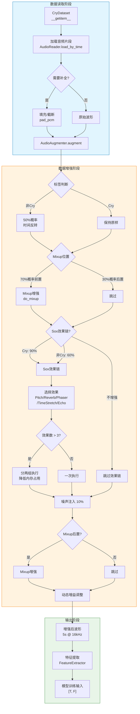
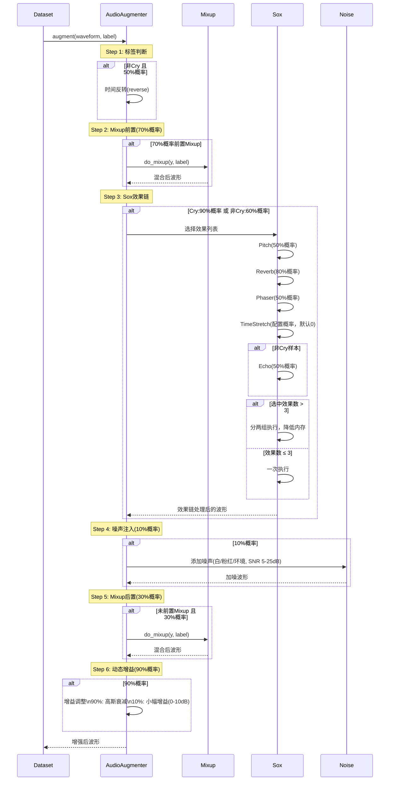
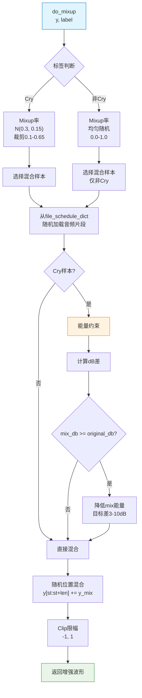
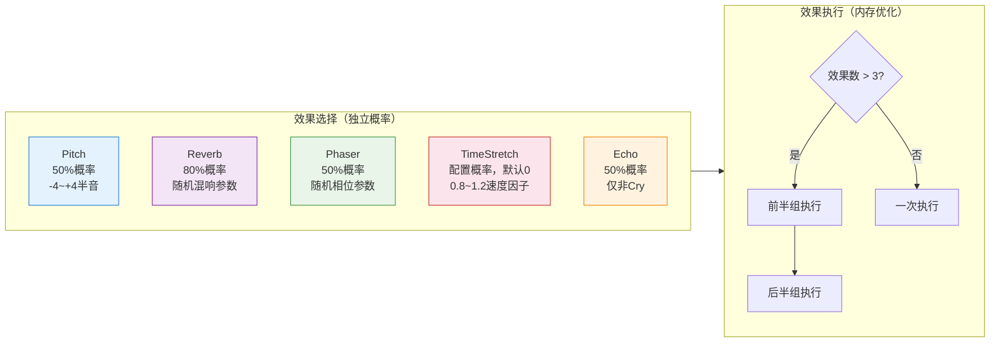
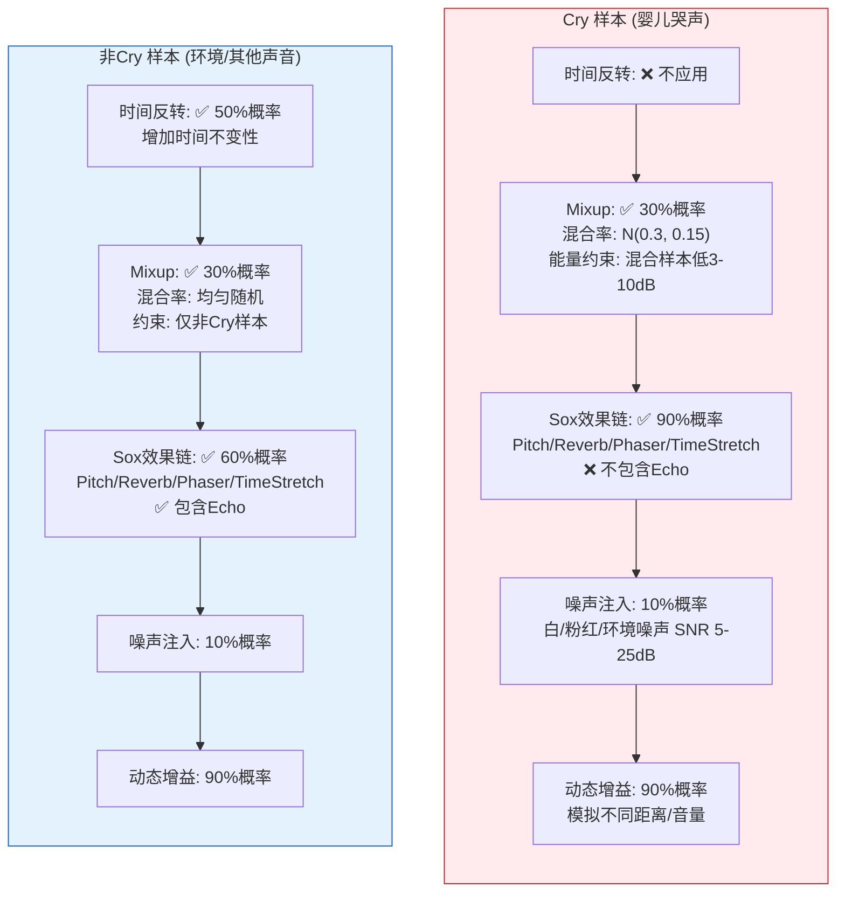

# 数据增强策略与流程

本文档详细描述婴儿哭声检测系统的数据增强策略，包括标签感知的Mixup增强、Sox音频效果链、噪声注入和动态增益调整。

## 数据读取与增强整体流程



## 数据增强详细流程



## Mixup增强详细流程

### Mixup规则矩阵

| 样本类型 | Mixup概率 | Mixup率分布 | 混合样本来源 | 能量约束 |
|---------|----------|------------|-------------|---------|
| **Cry** | 0.3 | 均值0.3, 标准差0.15, 裁剪至[0.1, 0.65] | 任意样本 | 混合样本能量 < 原始能量 - (3~10)dB |
| **非Cry** | 0.3 | 随机均匀分布 | 仅非Cry样本 | 无特殊约束 |

### Mixup流程图



## Sox效果链配置

### 效果链结构



### 各效果详细参数

#### Pitch (音高变换)
```python
pitch_rate = (random() - 0.5) * 8  # 范围: -4 到 +4 半音
```

#### Reverb (混响)
```python
{
    'reverberance': random() * 80 + 20,      # 20-100
    'high_freq_damping': random() * 100,      # 0-100
    'room_scale': random() * 100,             # 0-100
    'stereo_depth': random() * 100,           # 0-100
    'pre_delay': 0
}
```

#### Phaser (相位器)
```python
{
    'gain_in': random() * 0.5 + 0.5,          # 0.5-1.0
    'gain_out': random() * 0.5 + 0.5,         # 0.5-1.0
    'delay': random_int(1, 5),                # 1-5 ms
    'decay': random() * 0.4 + 0.1,            # 0.1-0.5
    'speed': random() * 1.9 + 0.1,            # 0.1-2.0 Hz
    'modulation_shape': random(['sinusoidal', 'triangular'])
}
```

#### TimeStretch (时间伸缩)
```python
duration_factor = random.uniform(0.8, 1.2)  # <1=加速, >1=减速

# 算法选择：
# 0.9~1.1: sox stretch (SOLA，适合小幅变化)
if 0.9 <= duration_factor <= 1.1:
    tfm.stretch(duration_factor, window=random.uniform(15, 25))
# 其他: sox tempo (WSOLA，适合大幅变化)
else:
    speed_factor = 1.0 / duration_factor
    # 确保 speed_factor 不落在 stretch 的最佳范围内
    if 0.9 <= speed_factor <= 1.1:
        speed_factor = 1.11
    tfm.tempo(speed_factor)
```

**注意**：TimeStretch 默认概率为 0，可在配置文件中启用：
```yaml
augmentation:
  time_stretch_prob: 0.3
```

#### Echo (回声 - 仅非Cry)
```python
{
    'gain_in': random() * 0.5 + 0.5,          # 0.5-1.0
    'gain_out': random() * 0.5 + 0.5,         # 0.5-1.0
    'n_echos': 1,
    'delays': [random_int(6, 60)],            # 6-60 ms
    'decays': [random() * 0.5]                # 0-0.5
}
```

## 配置参数汇总

### AugmentationConfig

| 参数 | 默认值 | 说明 |
|-----|-------|------|
| `cry_aug_prob` | 0.9 | Cry样本应用Sox效果链的概率 |
| `other_aug_prob` | 0.6 | 非Cry样本应用Sox效果链的概率 |
| `other_reverse_prob` | 0.5 | 非Cry样本时间反转概率 |
| `pitch_prob` | 0.5 | 音高变换效果概率 |
| `reverb_prob` | 0.8 | 混响效果概率 |
| `phaser_prob` | 0.5 | 相位器效果概率 |
| `echo_prob` | 0.5 | 回声效果概率（仅非Cry） |
| `time_stretch_prob` | 0.0 | 时间伸缩效果概率（默认禁用） |
| `noise_prob` | 0.1 | 噪声注入概率 |
| `gain_prob` | 0.9 | 动态增益调整概率 |

### MixupConfig

| 参数 | 默认值 | 说明 |
|-----|-------|------|
| `cry_mix_prob` | 0.3 | Cry样本Mixup概率 |
| `cry_mix_rate_mean` | 0.3 | Cry样本Mixup率均值 |
| `cry_mix_rate_std` | 0.15 | Cry样本Mixup率标准差 |
| `other_mix_prob` | 0.3 | 非Cry样本Mixup概率 |
| `mix_front_prob` | 0.7 | Mixup前置（效果链之前）概率 |

### NoiseConfig

| 参数 | 默认值 | 说明 |
|-----|-------|------|
| `white_noise_prob` | 0.3 | 白噪声权重 |
| `pink_noise_prob` | 0.4 | 粉红噪声权重 |
| `ambient_noise_prob` | 0.3 | 环境噪声权重（需配置文件列表） |
| `snr_min` | 5.0 | 最小信噪比 (dB) |
| `snr_max` | 25.0 | 最大信噪比 (dB) |
| `ambient_noise_dir` | None | 环境噪声文件目录 |
| `ambient_noise_files` | () | 环境噪声文件列表 |
| `pink_noise_alpha` | 1.0 | 粉红噪声 1/f^alpha 参数 |

## 标签感知增强策略

### 增强策略对比



## 内存优化：效果分组执行

Sox的时间伸缩（WSOLA算法）在处理长音频时内存占用较大。为降低内存峰值，当选中效果超过3个时，自动分成两组执行：

```
选中效果: [pitch, reverb, phaser, time_stretch]  (4个)
    ↓
第1组: [pitch, reverb]    → sox执行 → 中间波形
第2组: [phaser, time_stretch] → sox执行 → 最终波形

选中效果: [pitch, reverb, phaser]  (3个，不分组)
    ↓
一次执行: [pitch, reverb, phaser] → sox执行 → 最终波形
```

## 数据流示例

```
原始音频 (5秒 @ 16kHz)
    │
    ▼
┌────────────────────────────────────────┐
│  CrySample: "婴儿哭声.wav"              │
│  - 是否反转: 否 (Cry不反转)              │
│  - Mixup前置: 是 (70%概率)              │
│    └── 加载随机哭声片段                  │
│    └── 能量约束: 降低8dB                │
│    └── 混合位置: 随机                   │
│  - Sox效果链: 应用 (90%概率)             │
│    └── pitch(-1.2半音) ► reverb        │
│  - 噪声注入: 跳过 (90%跳过)              │
│  - Mixup后置: 跳过 (已前置)              │
│  - 增益调整: -15dB (模拟远距离)          │
└────────────────────────────────────────┘
    │
    ▼
增强后音频 ──▶ 特征提取 ──▶ 模型训练

────────────────────────────────────────────────

原始音频 (5秒 @ 16kHz)
    │
    ▼
┌────────────────────────────────────────┐
│  OtherSample: "电视声音.wav"            │
│  - 是否反转: 是 (50%概率)               │
│  - Mixup前置: 否 (30%概率)              │
│  - Sox效果链: 应用 (60%概率)             │
│    └── phaser ► echo(50ms) ► reverb    │
│  - 噪声注入: 添加粉红噪声 (SNR 15dB)     │
│  - Mixup后置: 是                        │
│    └── 加载随机非哭声片段                │
│    └── 无能量约束                       │
│  - 增益调整: +5dB                       │
└────────────────────────────────────────┘
    │
    ▼
增强后音频 ──▶ 特征提取 ──▶ 模型训练
```

## 设计要点

1. **标签差异化处理**: Cry和非Cry采用不同的增强策略，Cry更注重保持声学特征完整性，非Cry更注重多样性

2. **能量感知Mixup**: Cry样本混合时强制要求混合样本能量更低，模拟背景噪声而非主导声音

3. **样本隔离**: 非Cry样本Mixup时排除Cry样本，防止环境声音被哭声污染

4. **效果链动态组合**: 效果应用顺序随机，增加组合多样性

5. **内存优化分组**: 效果数超过3个时自动分两组执行，避免Sox时间伸缩算法的内存峰值问题

6. **时间伸缩算法自适应选择**: 根据伸缩因子自动选择 SOLA (stretch) 或 WSOLA (tempo) 算法，确保最优音质

7. **时间反转数据增强**: 仅应用于非Cry，增加时间不变性训练

8. **多类型噪声注入**: 支持白噪声、粉红噪声和环境采样噪声，SNR范围5-25dB
