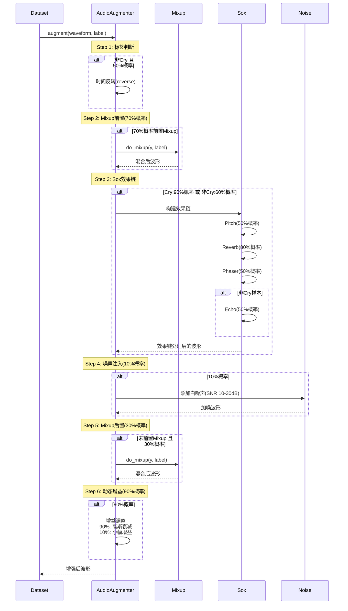
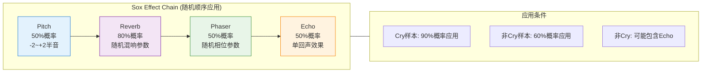

# 数据增强策略与流程

本文档详细描述婴儿哭声检测系统的数据增强策略，包括标签感知的Mixup增强、Sox音频效果链、噪声注入和动态增益调整。

## 数据读取与增强整体流程

```mermaid
flowchart TD
    subgraph DataLoading["数据读取阶段"]
        A[CryDataset<br/>__getitem__] --> B[加载音频片段<br/>AudioReader.load_by_time]
        B --> C[需要补全?]
        C -->|是| D[填充/截断<br/>pad_pcm]
        C -->|否| E[原始波形]
        D --> F[AudioAugmenter.augment]
        E --> F
    end

    subgraph Augmentation["数据增强阶段"]
        F --> G{标签判断}
        G -->|非Cry| H[50%概率<br/>时间反转]
        G -->|Cry| I[保持原样]
        H --> J{Mixup位置}
        I --> J

        J -->|70%概率前置| K[Mixup增强<br/>do_mixup]
        J -->|30%概率后置| L[跳过]
        K --> M{Sox效果链?}
        L --> M

        M -->|Cry: 90%| N[Sox效果链]
        M -->|非Cry: 60%| N
        M -->|不增强| O[跳过效果链]

        N --> P[Pitch 50%]
        P --> Q[Reverb 80%]
        Q --> R[Phaser 50%]
        R --> S{非Cry?}
        S -->|是| T[Echo 50%]
        S -->|否| U[跳过Echo]
        T --> V[噪声注入 10%]
        U --> V
        O --> V

        V --> W{Mixup后置?}
        W -->|是| X[Mixup增强]
        W -->|否| Y[跳过]
        X --> Z[动态增益调整]
        Y --> Z
    end

    subgraph Output["输出阶段"]
        Z --> AA[增强后波形<br/>5s @ 16kHz]
        AA --> AB[特征提取<br/>FeatureExtractor]
        AB --> AC[模型训练输入<br/>[T, F]]
    end

    style DataLoading fill:#e1f5fe,stroke:#0277bd
    style Augmentation fill:#fff3e0,stroke:#f57c00
    style Output fill:#e8f5e8,stroke:#388e3c
```

## 数据增强详细流程



## Mixup增强详细流程

### Mixup规则矩阵

| 样本类型 | Mixup概率 | Mixup率分布 | 混合样本来源 | 能量约束 |
|---------|----------|------------|-------------|---------|
| **Cry** | 0.3 | 均值0.3, 标准差0.15, 裁剪至[0.1, 0.65] | 任意样本 | 混合样本能量 < 原始能量 - (3~10)dB |
| **非Cry** | 0.3 | 随机均匀分布 | 仅非Cry样本 | 无特殊约束 |

### Mixup流程图

```mermaid
flowchart TD
    A[do_mixup<br/>y, label] --> B{标签判断}

    B -->|Cry| C[Mixup率<br/>N0.3, 0.15<br/>裁剪0.1-0.65]
    B -->|非Cry| D[Mixup率<br/>均匀随机<br/>0.0-1.0]

    C --> E[选择混合样本]
    D --> F[选择混合样本<br/>仅非Cry]

    E --> G[从file_schedule_dict<br/>随机加载音频片段]
    F --> G

    G --> H{Cry样本?}
    H -->|是| I[能量约束]
    H -->|否| J[直接混合]

    I --> K[计算dB差]
    K --> L{mix_db >= original_db?}
    L -->|是| M[降低mix能量<br/>目标差3-10dB]
    L -->|否| J
    M --> J

    J --> N[随机位置混合<br/>y[st:st+len] += y_mix]
    N --> O[Clip限幅<br/>-1, 1]
    O --> P[返回增强波形]

    style A fill:#e1f5fe,stroke:#0277bd
    style I fill:#fff3e0,stroke:#f57c00
    style P fill:#e8f5e8,stroke:#388e3c
```

## Sox效果链配置

### 效果链结构



### 各效果详细参数

#### Pitch (音高变换)
```python
pitch_rate = (random() - 0.5) * 4  # 范围: -2 到 +2 半音
```

#### Reverb (混响)
```python
{
    'reverberance': random() * 80 + 20,      # 20-100
    'high_freq_damping': random() * 100,      # 0-100
    'room_scale': random() * 100,             # 0-100
    'stereo_depth': random() * 100,           # 0-100
    'pre_delay': 0
}
```

#### Phaser (相位器)
```python
{
    'gain_in': random() * 0.5 + 0.5,          # 0.5-1.0
    'gain_out': random() * 0.5 + 0.5,         # 0.5-1.0
    'delay': random_int(1, 5),                # 1-5 ms
    'decay': random() * 0.4 + 0.1,            # 0.1-0.5
    'speed': random() * 1.9 + 0.1,            # 0.1-2.0 Hz
    'modulation_shape': random(['sinusoidal', 'triangular'])
}
```

#### Echo (回声 - 仅非Cry)
```python
{
    'gain_in': random() * 0.5 + 0.5,          # 0.5-1.0
    'gain_out': random() * 0.5 + 0.5,         # 0.5-1.0
    'n_echos': 1,
    'delays': [random_int(6, 60)],            # 6-60 ms
    'decays': [random() * 0.5]                # 0-0.5
}
```

## 配置参数汇总

### AugmentationConfig

| 参数 | 默认值 | 说明 |
|-----|-------|------|
| `cry_aug_prob` | 0.9 | Cry样本应用Sox效果链的概率 |
| `other_aug_prob` | 0.6 | 非Cry样本应用Sox效果链的概率 |
| `other_reverse_prob` | 0.5 | 非Cry样本时间反转概率 |
| `pitch_prob` | 0.5 | 音高变换效果概率 |
| `reverb_prob` | 0.8 | 混响效果概率 |
| `phaser_prob` | 0.5 | 相位器效果概率 |
| `echo_prob` | 0.5 | 回声效果概率（仅非Cry） |
| `noise_prob` | 0.1 | 噪声注入概率 |
| `gain_prob` | 0.9 | 动态增益调整概率 |

### MixupConfig

| 参数 | 默认值 | 说明 |
|-----|-------|------|
| `cry_mix_prob` | 0.3 | Cry样本Mixup概率 |
| `cry_mix_rate_mean` | 0.3 | Cry样本Mixup率均值 |
| `cry_mix_rate_std` | 0.15 | Cry样本Mixup率标准差 |
| `other_mix_prob` | 0.3 | 非Cry样本Mixup概率 |
| `mix_front_prob` | 0.7 | Mixup前置（效果链之前）概率 |

## 标签感知增强策略

### 增强策略对比

```mermaid
flowchart TB
    subgraph Cry["Cry 样本 (婴儿哭声)"]
        direction TB
        C1[时间反转: ❌ 不应用]
        C2[Mixup: ✅ 30%概率<br/>混合率: N(0.3, 0.15)<br/>能量约束: 混合样本低3-10dB]
        C3[Sox效果链: ✅ 90%概率<br/>Pitch → Reverb → Phaser<br/>❌ 不包含Echo]
        C4[噪声注入: 10%概率 SNR 10-30dB]
        C5[动态增益: 90%概率<br/>模拟不同距离/音量]

        C1 --> C2 --> C3 --> C4 --> C5
    end

    subgraph NonCry["非Cry 样本 (环境/其他声音)"]
        direction TB
        N1[时间反转: ✅ 50%概率<br/>增加时间不变性]
        N2[Mixup: ✅ 30%概率<br/>混合率: 均匀随机<br/>约束: 仅非Cry样本]
        N3[Sox效果链: ✅ 60%概率<br/>Pitch → Reverb → Phaser<br/>✅ 包含Echo]
        N4[噪声注入: 10%概率]
        N5[动态增益: 90%概率]

        N1 --> N2 --> N3 --> N4 --> N5
    end

    style Cry fill:#ffebee,stroke:#c62828
    style NonCry fill:#e3f2fd,stroke:#1565c0
```

## 数据流示例

```
原始音频 (5秒 @ 16kHz)
    │
    ▼
┌────────────────────────────────────────┐
│  CrySample: "婴儿哭声.wav"              │
│  - 是否反转: 否 (Cry不反转)              │
│  - Mixup前置: 是 (70%概率)              │
│    └── 加载随机哭声片段                  │
│    └── 能量约束: 降低8dB                │
│    └── 混合位置: 随机                   │
│  - Sox效果链: 应用                      │
│    └── pitch(-1.2半音) ► reverb        │
│  - 噪声注入: 跳过 (90%跳过)              │
│  - Mixup后置: 跳过 (已前置)              │
│  - 增益调整: -15dB (模拟远距离)          │
└────────────────────────────────────────┘
    │
    ▼
增强后音频 ──▶ 特征提取 ──▶ 模型训练

────────────────────────────────────────────────

原始音频 (5秒 @ 16kHz)
    │
    ▼
┌────────────────────────────────────────┐
│  OtherSample: "电视声音.wav"            │
│  - 是否反转: 是 (50%概率)               │
│  - Mixup前置: 否 (30%概率)              │
│  - Sox效果链: 应用                      │
│    └── phaser ► echo(50ms) ► reverb    │
│  - 噪声注入: 添加白噪声 (SNR 15dB)       │
│  - Mixup后置: 是                        │
│    └── 加载随机非哭声片段                │
│    └── 无能量约束                       │
│  - 增益调整: +5dB                       │
└────────────────────────────────────────┘
    │
    ▼
增强后音频 ──▶ 特征提取 ──▶ 模型训练
```

## 设计要点

1. **标签差异化处理**: Cry和非Cry采用不同的增强策略，Cry更注重保持声学特征完整性，非Cry更注重多样性

2. **能量感知Mixup**: Cry样本混合时强制要求混合样本能量更低，模拟背景噪声而非主导声音

3. **样本隔离**: 非Cry样本Mixup时排除Cry样本，防止环境声音被哭声污染

4. **效果链动态组合**: 效果应用顺序随机，增加组合多样性

5. **时间反转数据增强**: 仅应用于非Cry，增加时间不变性训练
