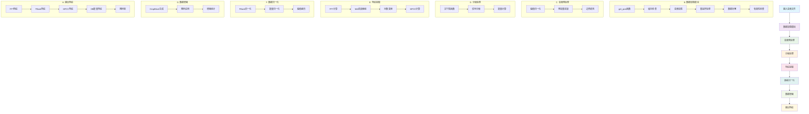
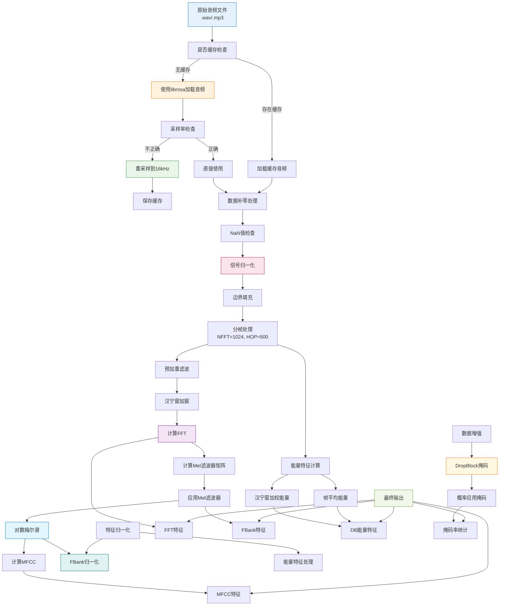
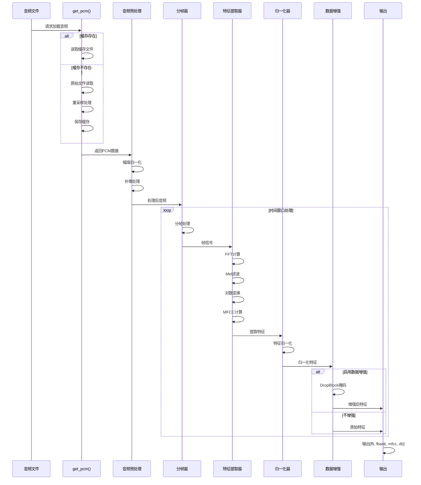
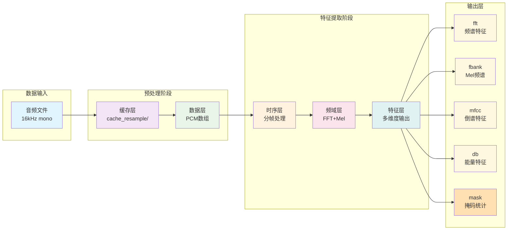

# ori/feature 特征提取流程分析

## 1. 系统概述

ori/feature.py 是一个完整的音频特征提取系统，主要用于婴儿啼哭检测。该系统基于 TensorFlow 实现，从 PCM 音频文件中提取多种特征，包括 FBank、MFCC、FFT 和能量特征等。

## 2. 处理流程总图

### 2.1 特征提取完整架构图



### 2.2 详细处理流程图



### 2.3 时序处理流程图



### 2.4 数据流图



## 3. 关键参数配置

### 3.1 音频参数
```python
# 基础音频参数
SR = 16000                    # 采样率：16kHz
NFFT = 1024                   # FFT点数：1024
HOP = 500                     # 帧移：500 samples (约31.25ms)
N_MELS = 32                   # Mel滤波器数量：32
MEL_FMIN = 250                # Mel滤波器最低频率：250Hz
MEL_FMAX = 8000               # Mel滤波器最高频率：8000Hz
```

### 3.2 特征参数
```python
# FBank参数
IF_FFT = True                 # 使用FFT
N_MFCC = 16                   # MFCC系数数量：16

# 时序参数
Y_SLICE_LEN = 30              # 音频片段长度：30秒
Y_PAD_LEN = 2                  # 填充长度：2秒
DURATION = 25 + Y_PAD_LEN      # 总时长：27秒
FRAME_PRE_SECOND = int(SR / HOP)  # 每秒帧数：32帧
```

### 3.3 缓存配置
```python
# 缓存路径
CACHE_RESAMPLE_PATH = './cache_resample'  # 重采样缓存目录
FEAT_USE_ORI = False          # 是否使用原始特征
STRIDE = 1                    # 处理步长
```

## 4. 特征提取完整流程

### 4.1 数据加载模块 (get_pcm 函数)

**功能**：加载和重采样音频文件
```python
def get_pcm(file_name, sr=16000, offset=0.0, duration=None, **kwargs):
```

**处理步骤**：
1. **缓存检查**：检查是否存在重采样缓存文件
2. **音频加载**：使用 `librosa.load()` 加载原始音频
3. **重采样处理**：如果采样率不是16kHz，进行重采样
4. **数据补零**：如果音频长度不足，进行补零处理
5. **数据有效性检查**：检查是否存在NaN值

**缓存机制**：
- 缓存文件名格式：`cache_{sr}_{filename}.wav`
- 自动检测并创建缓存目录
- 支持音频片段加载 (offset, duration)

### 4.2 特征提取模块 (Feature_net 类)

#### 4.2.1 初始化配置
```python
class Feature_net(tf.keras.Model):
    def __init__(self, mask_rate=0., mask_prob=0., use_fbank_norm=True,
                 use_db_norm=False, fbank_decary=0.9, db_avg_win=0.):
```

**关键配置**：
- `use_fbank_norm`: 是否使用FBank归一化
- `use_db_norm`: 是否使用dB特征归一化
- `fbank_decary`: FBank归一化衰减系数
- `mask_rate`: 数据掩码率（数据增强）

#### 4.2.2 预处理步骤

**1. 信号预处理**：
```python
def preemph(self, signal, coeff=0.95):
    return tf.concat([signal[:, 0:1], signal[:, 1:] - coeff * signal[:, :-1]], axis=-1)
```

**2. 分帧处理**：
```python
pcm = tf.pad(pcm, [[0, 0], [NFFT - HOP, 0]])  # 边界填充
framed_signals = tf.signal.frame(pcm, NFFT, HOP, pad_end=False)
```

**3. 计算能量特征**：
```python
pcm_energy = tf.square(pcm)
energy_frames = tf.signal.frame(pcm_energy, NFFT, HOP, pad_end=False)
sound_db_average = energy_to_db(tf.reduce_mean(energy_frames, axis=-1))
sound_db_hann = energy_frames * self.window / self.window_area
sound_db_average_hann = energy_to_db(tf.reduce_mean(sound_db_hann, axis=-1))
```

#### 4.2.3 特征提取核心算法

**1. FFT特征提取**：
```python
# 应用汉宁窗
y_rfft = tf.signal.rfft(framed_gain * self.window, [NFFT])
fft = tf.abs(y_rfft)  # 获取幅度谱
```

**2. Mel滤波器组**：
```python
# Mel滤波器权重矩阵
self.mel_matrix = tf.signal.linear_to_mel_weight_matrix(
    num_mel_bins=N_MELS,
    num_spectrogram_bins=NFFT // 2 + 1,
    sample_rate=SR,
    lower_edge_hertz=MEL_FMIN,
    upper_edge_hertz=MEL_FMAX
)

# 计算Mel谱
y_melspec = tf.matmul(y_fft, self.mel_matrix)
```

**3. MFCC特征提取**：
```python
# 从Mel谱计算MFCC
y_mfcc = tf.signal.mfccs_from_log_mel_spectrograms(
    tf.math.log(y_melspec + 1e-6)[:, :, :N_MFCC]
)
```

**4. FBank特征归一化**：
```python
if self.use_fbank_norm:
    # 计算最大值
    fbank_max_ = tf.reduce_max(fbank_ori[:, :, 2:-2], axis=[2], keepdims=True)

    # 指数平滑更新
    t = tf.reduce_mean(fbank_max_[:, :1, :], -2, keepdims=True)
    t = tf.where(maxs > t, t * decary_up + maxs * (1 - decary_up),
                 t * decary + maxs * (1 - decary))

    # 归一化处理
    fbank = tf.where(fbank_max != fbank_min,
                     (fbank_ori - fbank_min) / (fbank_max - fbank_min),
                     fbank_ori)
    fbank = tf.clip_by_value(fbank, 0., 1.0)
```

#### 4.2.4 数据增强（可选）

**DropBlock增强**：
```python
def dropblock(x, keep_prob, block_size):
    # 创建随机掩码
    mask = tf.nn.relu(tf.sign(gamma - tf.random.uniform(sampling_mask_shape)))
    # 应用掩码
    mask_pool = tf.nn.max_pool(mask, [1, block_size, block_size, 1], [1, 1, 1, 1], 'SAME')
    return mask_pool
```

### 4.3 批量处理模块 (get_feats_from_file 函数)

**功能**：从音频文件批量提取特征
```python
def get_feats_from_file(file_name, length_limit=None, cache_path=None)
```

**处理流程**：
1. **缓存检查**：检查特征缓存是否存在
2. **音频加载**：使用 `get_pcm()` 加载音频
3. **音频处理**：
   - 补零处理：`y = np.concatenate([y, np.zeros(64000,)])`
   - 最小时长保证：不足7秒的音频循环复制
   - 幅值归一化：`y = librosa.util.normalize(y)`
4. **分窗口处理**：将音频分割为多个时间窗口
5. **结果返回**：返回包含PCM数据的字典列表

### 4.4 单次特征提取模块 (get_feat_from_pcm 函数)

**功能**：直接从PCM数据提取特征
```python
def get_feat_from_pcm(y, mask_callback=None)
```

**输出特征**：
- `fbank`: Mel频谱特征 (63, 26)
- `fft`: FFT幅度谱 (63, 26)
- `mfcc`: MFCC特征 (63, 26)
- `db`: 能量特征 (62, 2)
- `y`: 处理后的音频信号 (SR*DUR)

## 5. 输出特征说明

### 5.1 输出列表
```python
outputs = [fft, fbank, mfcc, db, masked_rate]
```

### 5.2 特征维度
- **FFT特征**: (batch, frames, NFFT//2+1)
- **FBank特征**: (batch, frames, N_MELS)
- **MFCC特征**: (batch, frames, N_MFCC)
- **DB特征**: (batch, frames, 2) [平均能量, 加权能量]
- **掩码率**: (batch,) [用于数据增强统计]

### 5.3 特征归一化

#### 5.3.1 对数域转换
```python
def amplitude_to_db(self, S):
    return (tf.maximum(tf.math.log(tf.maximum(tf.square(S), 1e-8)) / tf.math.log(10.), -8) + 8) / 8
```

#### 5.3.2 幅值归一化
```python
# 转换到0-1范围
fbank = tf.where(fbank_max != fbank_min,
                 (fbank_ori - fbank_min) / (fbank_max - fbank_min),
                 fbank_ori)
fbank = tf.clip_by_value(fbank, 0., 1.0)
```

## 6. 技术特点

### 6.1 高性能优化
- **TensorFlow图优化**：使用 `@tf.function` 装饰器
- **GPU/CPU分离**：特定操作在CPU上执行
- **缓存机制**：支持重采样和特征缓存
- **批处理**：高效的时间序列分块处理

### 6.2 鲁棒性设计
- **异常处理**：完善的错误捕获和处理
- **边界检查**：数据长度和有效性验证
- **数值稳定**：使用小常数避免除零错误
- **NaN处理**：检查和处理NaN值

### 6.3 数据增强
- **DropBlock**：随机的特征掩码增强
- **动态掩码**：根据概率应用不同的掩码
- **音频切片**：重叠的时间窗口采样

## 7. 应用场景

### 7.1 主要用途
- **婴儿啼哭检测**：核心应用场景
- **音频分类**：通用音频任务
- **语音识别**：预处理特征提取
- **声学事件检测**：环境音频分析

### 7.2 推荐配置
```python
# FBank特征配置
feature_type: 'fbank'
feature_dim: 32
sample_rate: 16000
frame_length: 25  # 帧长度(ms)
frame_shift: 31.25  # 帧移(ms)

# MFCC特征配置
feature_type: 'mfcc'
feature_dim: 16
# 其他参数相同
```

## 8. 性能参数

### 8.1 处理速度
- **采样率**: 16kHz
- **帧率**: 32 FPS (frames per second)
- **延迟**: ~31.25ms per frame
- **实时性**: 支持实时处理

### 8.2 内存使用
- **缓存优化**: 显著减少I/O开销
- **批量处理**: 高效的内存管理
- **精度控制**: float32以保证精度

这个系统提供了一个完整的高质量音频特征提取流水线，特别适用于婴儿啼哭检测等音频分类任务。
