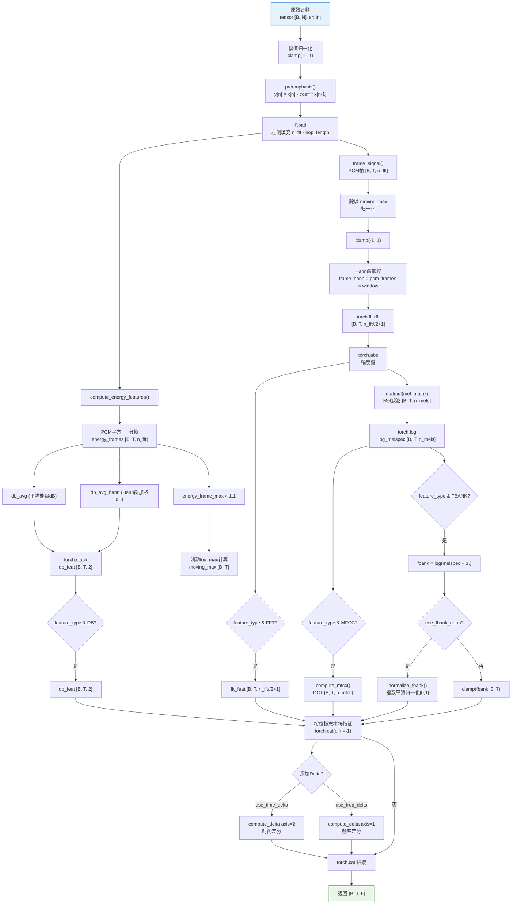

# 特征提取流程分析 (PyTorch 版)

## 1. 系统概述

[dataset/feature.py](../dataset/feature.py) 是基于 **PyTorch** 的音频特征提取模块，支持 GPU 加速的批量处理。输入原始音频波形，输出可直接送入 Transformer 的特征张量 `[B, T, F]`。

### 核心改进
- **GPU 加速**: 整个流程使用 PyTorch 张量操作，支持 CUDA 加速
- **批量处理**: 直接处理 `[B, N]` 批量波形，无需逐样本循环
- **torchaudio 集成**: 使用 `torchaudio.functional.melscale_fbanks` 生成 Mel 滤波器
- **初始化时创建 Mel 矩阵**: 在 `__init__` 中预计算并注册为 buffer，无需运行时计算
- **位标志特征类型**: 使用整数位标志组合多种特征类型（FBANK=1, DB=2, MFCC=4, FFT=8）

## 2. 处理流程总图

### 2.1 特征提取完整架构图

```mermaid
graph TB
    A["输入音频波形\ntorch.Tensor [B, N]"] --> B["音频预处理"]
    B --> C["分帧处理\n(n_fft=1024, hop=500)"]
    C --> D["特征提取"]
    D --> E["特征组合\nforward()"]
    E --> F["Delta特征\n(可选)"]
    F --> G["输出 [B, T, F]"]

    subgraph "B. 音频预处理"
        B1[幅值归一化<br/>clamp(-1, 1)] --> B2[预加重滤波]
        B2 --> B3[F.pad 左侧填充]
    end

    subgraph "C. 分帧"
        C1[frame_signal<br/>PCM帧 [B, T, n_fft]] --> C2[Hann窗加权]
        C2 --> C3[torch.fft.rfft]
    end

    subgraph "D. 特征提取"
        D1[FFT计算<br/>幅度谱] --> D2[Mel滤波器组<br/>matmul]
        D2 --> D3[torch.log → FBank]
        D3 --> D4[DCT → MFCC]
        D1 --> D5[FFT特征]
        C1 --> D6[能量(dB)特征]
    end

    subgraph "E. 特征组合"
        E1["按feature_type位标志选择<br/>FBANK(1) | DB(2) | MFCC(4) | FFT(8)"]
        E2["特征拼接<br/>dim=-1"]
    end

    subgraph "F. Delta特征"
        F1["时间差分 axis=2<br/>(use_time_delta)"]
        F2["频率差分 axis=1<br/>(use_freq_delta)"]
        F3["torch.cat"]
    end

    style A fill:#e1f5fe
    style G fill:#e8f5e8
    style D fill:#fff3e0
    style F fill:#f3e5f5
```

### 2.2 详细处理流程图



### 2.3 forward() 主流程

```mermaid
flowchart TD
    A["forward(waveform: [B, N])"] --> B["幅值归一化<br/>clamp(-1, 1)"]
    B --> C["preemphasis()"]
    C --> D["F.pad 左侧填充"]

    D --> E["compute_energy_features()"]
    E --> E1["返回: db_feat [B, T, 2], moving_max [B, T]"]

    D --> F["frame_signal() → PCM帧"]
    F --> F1["PCM帧 / moving_max"]
    F1 --> F2["Hann窗 → FFT → 幅度谱"]

    F2 --> G["Mel滤波 → log_melspec"]
    G --> H{按feature_type位标志}

    H -->|FBANK(1)| I1["fbank特征"]
    H -->|DB(2)| I2["db_feat特征"]
    H -->|MFCC(4)| I3["mfcc特征"]
    H -->|FFT(8)| I4["fft_feat特征"]

    I1 --> J["torch.cat(features, dim=-1)"]
    I2 --> J
    I3 --> J
    I4 --> J

    J --> K{use_time_delta?}
    K -->|是| L["compute_delta axis=2<br/>时间差分"]
    L --> M["features.append"]
    K -->|否| M

    M --> N{use_freq_delta?}
    N -->|是| O["compute_delta axis=1<br/>频率差分"]
    O --> P["features.append"]
    N -->|否| P

    P --> Q["torch.cat(features, dim=-1)"]
    Q --> R["返回 [B, T, F]"]

    style A fill:#e1f5fe,stroke:#0277bd
    style R fill:#e8f5e8,stroke:#388e3c
```

## 3. 关键参数配置

### 3.1 FeatureConfig 参数

| 参数 | 默认值 | 说明 |
|------|--------|------|
| `feature_type` | `1` | 特征类型位标志：FBANK=1, DB=2, MFCC=4, FFT=8，可组合如 3=FBANK+DB |
| `n_fft` | 1024 | FFT窗口大小 |
| `hop_length` | 500 | 帧移（31.25ms @ 16kHz） |
| `n_mels` | 32 | Mel滤波器数量 |
| `n_mfcc` | 16 | MFCC系数数量 |
| `fmin` | 250 | Mel滤波器最低频率 (Hz) |
| `fmax` | 8000 | Mel滤波器最高频率 (Hz) |
| `preemphasis` | 0.95 | 预加重系数 |
| `use_fbank_norm` | `True` | 是否对FBank做指数平滑归一化 |
| `fbank_decay` | 0.9 | FBank归一化的衰减系数 |
| `use_db_norm` | `False` | 是否对db特征做滑动最大归一化 |
| `use_time_delta` | `False` | 添加时间差分特征（+base_dim） |
| `use_freq_delta` | `False` | 添加频率差分特征（+base_dim） |

### 3.2 FeatureType 位标志定义

```python
class FeatureType(IntEnum):
    FBANK = 1  # 001
    DB = 2     # 010
    MFCC = 4   # 100
    FFT = 8    # 1000
```

**组合示例：**
| feature_type | 二进制 | 组合特征 |
|--------------|--------|----------|
| 1 | 0001 | FBANK only |
| 2 | 0010 | DB only |
| 3 | 0011 | FBANK + DB |
| 5 | 0101 | FBANK + MFCC |
| 7 | 0111 | FBANK + DB + MFCC |
| 15 | 1111 | All features |

### 3.3 输出维度参考表

| 配置 | Base Dim | +time_delta | +freq_delta | +both deltas |
|------|----------|-------------|-------------|--------------|
| FBANK (n_mels=32) | `[B, T, 32]` | `[B, T, 64]` | `[B, T, 64]` | `[B, T, 96]` |
| FBANK + DB (1+2=3) | `[B, T, 34]` | `[B, T, 68]` | `[B, T, 68]` | `[B, T, 102]` |
| FBANK + MFCC (1+4=5) | `[B, T, 48]` | `[B, T, 96]` | `[B, T, 96]` | `[B, T, 144]` |
| MFCC only (4) | `[B, T, 16]` | `[B, T, 32]` | `[B, T, 32]` | `[B, T, 48]` |
| FFT only (8) | `[B, T, 513]` | `[B, T, 1026]` | `[B, T, 1026]` | `[B, T, 1539]` |

**注**：B = batch_size, T = time_frames。5s音频 @ 16kHz，hop_length=500 时 T≈32。

## 4. API 文档

### 4.1 初始化

```python
from utils.config import FeatureConfig
from dataset.feature import FeatureExtractor, FeatureType

# 方式1: 仅FBank
config = FeatureConfig(feature_type=FeatureType.FBANK, n_mels=32)

# 方式2: FBank + DB (feature_type=3)
config = FeatureConfig(feature_type=FeatureType.FBANK | FeatureType.DB, n_mels=32)

# 方式3: 所有特征 (feature_type=15)
config = FeatureConfig(
    feature_type=FeatureType.FBANK | FeatureType.DB | FeatureType.MFCC | FeatureType.FFT,
    n_mels=32,
    n_mfcc=16
)

extractor = FeatureExtractor(config, sr=16000)
```

### 4.2 forward(waveform) - 批量特征提取

```python
# waveform: [B, N] 或 [N] torch.Tensor
features = extractor(waveform)
# 返回: torch.Tensor [B, T, F]
```

**示例：**
```python
import torch

# 批量处理 8 个 5 秒音频样本
waveforms = torch.randn(8, 80000)  # 8 samples, 5s @ 16kHz
features = extractor(waveforms)
# features.shape == (8, 32, 34)  # batch=8, frames=32, dim=34 (FBANK+DB)

# 单样本也支持
single = torch.randn(80000)
features = extractor(single)
# features.shape == (1, 32, 34)
```

### 4.3 内部方法

#### compute_energy_features(signal)
```python
# signal: [B, N] 已填充的音频信号
db_feat, moving_max = extractor.compute_energy_features(signal)
# 返回:
#   db_feat: [B, T, 2] - 能量特征
#     - use_db_norm=False: [db_avg, db_avg_hann]
#     - use_db_norm=True: [db_avg_hann, moving_max_normalized]
#   moving_max: [B, T] - 滑动最大值，用于PCM归一化
```

#### compute_mfcc(log_mel)
```python
# log_mel: [B, n_mels, T]
mfcc = extractor.compute_mfcc(log_mel)
# 返回: [B, n_mfcc, T]
# 内部: DCT-II 矩阵乘法
```

#### compute_delta(features, axis)
```python
# features: [B, F, T]
delta = extractor.compute_delta(features, axis=2)  # 时间差分
# 返回: [B, F, T] (padding 后差分)
# 算法: (feat[t+1] - feat[t-1]) / 2
```

#### normalize_fbank(fbank)
```python
# fbank: [B, T, n_mels] log Mel特征
fbank_norm = extractor.normalize_fbank(fbank)
# 返回: [B, T, n_mels] 归一化到[0, 1]范围
# 算法: 指数滑动最大归一化，带峰值检测和自适应衰减
```

## 5. 核心实现细节

### 5.1 能量特征计算 (compute_energy_features)

```python
def compute_energy_features(self, signal):
    # Step 1: PCM平方能量
    energy = signal ** 2

    # Step 2: 分帧
    energy_frames = self.frame_signal(energy, n_fft, hop_length)  # [B, T, n_fft]

    # Step 3: 平均能量dB
    db_avg = _energy_to_db(energy_frames.mean(dim=-1))

    # Step 4: Hann窗加权能量dB
    energy_frames_hann = energy_frames * window / window_area
    db_avg_hann = _energy_to_db(energy_frames_hann.sum(dim=-1))

    if not use_db_norm:
        return torch.stack([db_avg, db_avg_hann], dim=-1), torch.ones(...)

    # Step 5: 滑动最大归一化
    energy_frame_max = energy_frames.max(dim=-1) * 1.1
    log_max = torch.log(energy_frame_max)

    # 指数平滑，上升快(3x)，下降慢
    decay_up = 1 - (1 - decay) * 3
    for t in range(T):
        t = torch.where(cur > t, t * decay_up + cur * (1 - decay_up),
                                       t * decay + cur * (1 - decay))

    moving_max = torch.exp(smoothed_log_max)
    db_feat = torch.stack([db_avg_hann, moving_max], dim=-1)
    return db_feat, moving_max
```

### 5.2 FBank归一化（指数平滑）

```python
def normalize_fbank(self, fbank):
    # fbank: [B, T, n_mels]
    decay = self.config.fbank_decay
    decay_up = 1 - (1 - decay) * 3  # 上升更快

    # 每帧最大/平均值（去除边缘2点）
    fbank_max = fbank[:, :, 2:-2].max(dim=2, keepdim=True) * 1.1
    fbank_avg = fbank[:, :, 2:-2].mean(dim=2, keepdim=True)

    # 滑动最大计算
    t = fbank_max[:, :1, :].mean(dim=2, keepdim=True)
    flag = False
    for i in range(T):
        # 上升用更快的decay_up，下降用正常decay
        t = torch.where(maxs > t, t * decay_up + maxs * (1 - decay_up),
                                       t * decay + maxs * (1 - decay))
        # 低于平均值时重置逻辑
        flag = torch.where((t < avgs) & ~flag, True, False)
        t = torch.where((t < avgs) & flag, avgs * 2, t)

    # 归一化到 [0, 1]
    return torch.clamp((fbank - fbank_min) / (fbank_max - fbank_min), 0., 1.0)
```

### 5.3 Mel 滤波器组创建

```python
# __init__ 中使用 torchaudio.functional 创建
mel_fb = FA.melscale_fbanks(
    n_freqs=config.n_fft // 2 + 1,
    f_min=config.fmin,
    f_max=config.fmax,
    n_mels=config.n_mels,
    sample_rate=sr,
    norm="slaney",
    mel_scale="slaney",
)
self.register_buffer('_mel_matrix', mel_fb)  # [n_fft//2+1, n_mels]
```

### 5.4 能量到dB转换

```python
def _energy_to_db(self, energy, amin=1e-8):
    db = torch.log10(torch.clamp(energy, min=amin))
    # 归一化到[0, +inf]（clip在-8dB以上）
    return (torch.clamp(db, min=-8) + 8) / 8
```

## 6. 推荐配置

### FBank + DB（推荐，34维，feature_type=3）
```yaml
feature:
  feature_type: 3  # FBANK(1) | DB(2)
  n_mels: 32
  n_fft: 1024
  hop_length: 500
  fmin: 250
  fmax: 8000
  use_fbank_norm: true
  use_db_norm: false
  use_time_delta: false
  use_freq_delta: false
```

### FBank + DB + Time Delta（66维）
```yaml
feature:
  feature_type: 3
  n_mels: 32
  use_fbank_norm: true
  use_db_norm: false
  use_time_delta: true
```

### MFCC Only（16维）
```yaml
feature:
  feature_type: 4  # MFCC only
  n_mfcc: 16
```

## 7. 技术特点

- **纯 PyTorch 实现**: 所有操作使用 torch 张量，支持 GPU 加速和自动求导
- **批量处理原生支持**: 输入输出均为 batch-first 格式 `[B, ...]`
- **位标志特征组合**: 使用整数位标志灵活组合多种特征类型
- **自适应归一化**: FBank和DB特征都使用指数滑动最大归一化，上升快下降慢
- **能量归一化**: 使用moving_max对PCM帧进行归一化，提高鲁棒性
- **torchaudio Mel 滤波器**: 使用 `torchaudio.functional.melscale_fbanks`，与 librosa 兼容
- **预计算 Mel 矩阵**: 在 `__init__` 中创建并注册为 buffer，支持模型保存/加载
- **灵活的设备处理**: 内部自动处理设备移动（`.to(device)`），支持 CPU/GPU
- **Delta 特征**: 使用 `F.pad` + 中央差分，支持时间和频率两个维度
- **数值稳定**: `torch.clamp(min=1e-8)` 避免 log(0)，能量 dB 转换使用 clip

## 8. 与旧版 NumPy 实现的差异

| 特性 | NumPy 版 | PyTorch 版 |
|------|---------|-----------|
| 输入格式 | `[N]` 单样本 | `[B, N]` 批量 |
| 输出格式 | `[T, F]` | `[B, T, F]` |
| 特征类型 | 字符串 'fbank'/'mfcc'/'all' | 整数位标志 1/2/4/8 |
| Mel 矩阵 | 懒加载 (librosa) | 初始化时创建 (torchaudio) |
| 设备 | CPU only | CPU/GPU |
| API | `extract_with_deltas(y, sr)` | `forward(waveform)` 或 `__call__` |
| STFT | `librosa.stft` | `torch.stft` / `torch.fft.rfft` |
| Delta | `np.gradient` | `F.pad` + 手动差分 |
| 能量归一化 | 无 | moving_max 滑动最大归一化 |
| FBank归一化 | 简单min-max | 指数滑动最大+峰值检测 |
