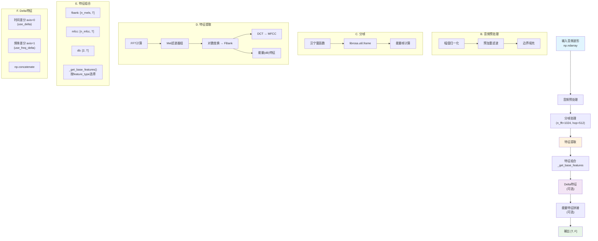
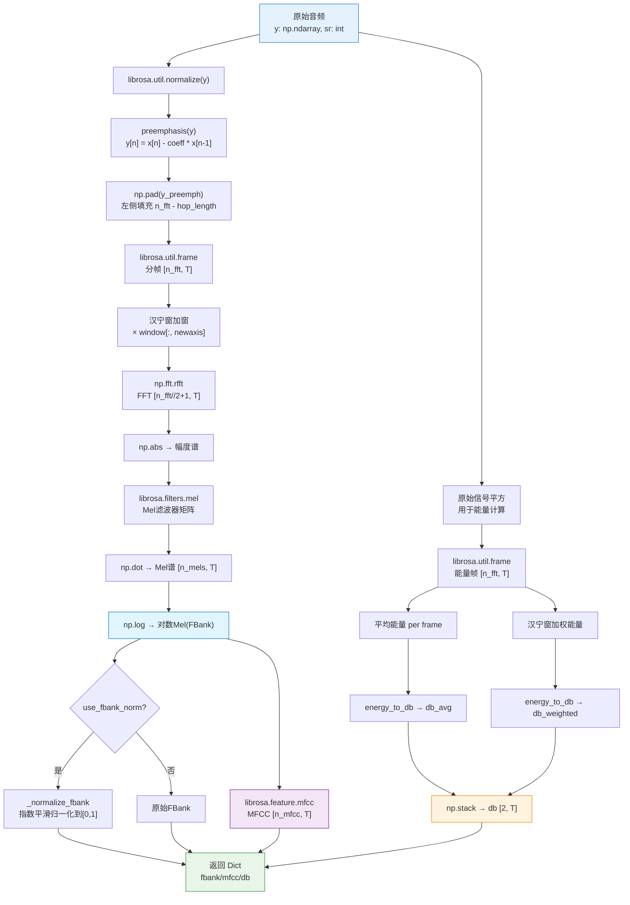
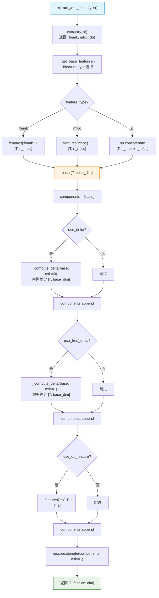

# 特征提取流程分析

## 1. 系统概述

[dataset/feature.py](../dataset/feature.py) 是音频特征提取模块，基于 NumPy/Librosa 实现，支持从音频波形中提取多种特征，包括 FBank、MFCC 和能量特征等。支持通过配置灵活组合特征类型、添加 delta 特征和能量特征。

## 2. 处理流程总图

### 2.1 特征提取完整架构图



### 2.2 详细处理流程图



### 2.3 extract_with_deltas() 主API流程



## 3. 关键参数配置

### 3.1 FeatureConfig 参数

| 参数 | 默认值 | 说明 |
|------|--------|------|
| `feature_type` | `'fbank'` | 基础特征类型：`'fbank'`、`'mfcc'`、`'all'`（fbank+mfcc） |
| `n_fft` | 1024 | FFT窗口大小 |
| `hop_length` | 512 | 帧移（32ms @ 16kHz） |
| `n_mels` | 64 | Mel滤波器数量 |
| `n_mfcc` | 16 | MFCC系数数量 |
| `fmin` | 250 | Mel滤波器最低频率 (Hz) |
| `fmax` | 8000 | Mel滤波器最高频率 (Hz) |
| `preemphasis` | 0.97 | 预加重系数 |
| `use_fbank_norm` | True | 是否对FBank做指数平滑归一化 |
| `fbank_decay` | 0.9 | FBank归一化的衰减系数 |
| `use_delta` | False | 添加时间差分特征（+base_dim） |
| `use_freq_delta` | False | 添加频率差分特征（+base_dim） |
| `use_db_feature` | False | 添加能量特征（+2维） |
| `use_db_norm` | True | 对db特征归一化到 [0, 1] |

### 3.2 输出维度参考表

| 配置 | Base | +delta | +freq_delta | +db |
|------|------|--------|-------------|-----|
| fbank (n_mels=64) | `[T, 64]` | `[T, 128]` | `[T, 192]` | `[T, 66]` / `[T, 130]` / `[T, 194]` |
| mfcc (n_mfcc=16) | `[T, 16]` | `[T, 32]` | `[T, 48]` | `[T, 18]` / `[T, 34]` / `[T, 50]` |
| all (64+16) | `[T, 80]` | `[T, 160]` | `[T, 240]` | `[T, 82]` / `[T, 162]` / `[T, 242]` |

**注**：T = time_frames，5s音频 @ 16kHz，hop_length=512 时 T≈157。db 特征固定 2 通道（平均能量 + 汉宁窗加权能量）。

## 4. API 文档

### 4.1 extract(y, sr) - 提取所有基础特征

```python
features = extractor.extract(y, sr)
# 返回 dict:
# {
#   'fbank': np.ndarray  shape (n_mels, frames)   对数Mel频谱
#   'mfcc':  np.ndarray  shape (n_mfcc, frames)   MFCC倒谱特征
#   'db':    np.ndarray  shape (2, frames)         能量特征
#                        db[0]: 帧平均能量 (归一化到[0,1])
#                        db[1]: 汉宁窗加权能量 (归一化到[0,1])
# }
```

### 4.2 extract_with_deltas(y, sr) - 主API

```python
features = extractor.extract_with_deltas(y, sr)
# 返回: np.ndarray shape [time_frames, feature_dim]
# feature_dim 由 feature_type, use_delta, use_freq_delta, use_db_feature 决定
```

**示例：**
```python
from utils.config import FeatureConfig
from dataset.feature import FeatureExtractor

config = FeatureConfig(
    feature_type='fbank',  # 使用FBank
    n_mels=64,
    use_delta=True,        # 添加时间差分 → 128维
    use_db_feature=False,
)
extractor = FeatureExtractor(config)

# y: 1D float32 waveform, sr=16000
features = extractor.extract_with_deltas(y, sr=16000)
# features.shape == (157, 128)  # 5s音频，64+64 delta
```

### 4.3 _get_base_features(features) - 特征类型选择

```python
# feature_type='fbank':
base = features['fbank'].T         # [T, n_mels]

# feature_type='mfcc':
base = features['mfcc'].T          # [T, n_mfcc]

# feature_type='all':
base = np.concatenate([
    features['fbank'].T,            # [T, n_mels]
    features['mfcc'].T              # [T, n_mfcc]
], axis=1)                          # [T, n_mels + n_mfcc]
```

### 4.4 _compute_delta(features, axis) - 差分特征

使用中央差分（central difference）计算：

```
delta[t] = (feat[t+1] - feat[t-1]) / 2
```

- `axis=0`：时间差分（`use_delta`），捕捉频谱随时间的变化
- `axis=1`：频率差分（`use_freq_delta`），捕捉频率维度的局部梯度

## 5. 特征归一化

### 5.1 能量到dB转换

```python
def energy_to_db(energy: np.ndarray, ref=1.0, amin=1e-8) -> np.ndarray:
    db = 10 * np.log10(np.maximum(energy, amin) / ref)
    # 归一化到[0, 1]（clip在-8dB以上）
    return (np.maximum(db, -8) + 8) / 8
```

### 5.2 FBank归一化（指数平滑）

```python
def _normalize_fbank(self, fbank: np.ndarray) -> np.ndarray:
    decay = self.config.fbank_decay  # 默认 0.9

    # 每帧频率维度的最大/最小值
    fbank_max = np.max(fbank, axis=0, keepdims=True)   # (1, T)
    fbank_min = np.min(fbank, axis=0, keepdims=True)   # (1, T)

    # 对 max 做 attack-decay 指数平滑
    # 只在 max 下降时平滑（上升立即响应）
    for t in range(1, T):
        prev, curr = smoothed[t-1], fbank_max[t]
        smoothed[t] = decay * prev + (1 - decay) * curr if curr > prev else curr

    # 归一化到 [0, 1]
    return np.clip((fbank - fbank_min) / range_val, 0.0, 1.0)
```

## 6. 推荐配置

### FBank + Delta（推荐，128维）
```yaml
feature:
  feature_type: 'fbank'
  n_mels: 64
  n_fft: 1024
  hop_length: 512
  fmin: 250
  fmax: 8000
  use_delta: true
  use_freq_delta: false
  use_db_feature: false
  use_fbank_norm: true
```

### FBank + Time Delta + Freq Delta + DB（194维）
```yaml
feature:
  feature_type: 'fbank'
  n_mels: 64
  use_delta: true
  use_freq_delta: true
  use_db_feature: false  # db会使feature_dim变为194而非192
```

### FBank + DB（66维，含能量特征）
```yaml
feature:
  feature_type: 'fbank'
  n_mels: 64
  use_delta: false
  use_db_feature: true
  use_db_norm: true
```

### All (FBank + MFCC)（80维）
```yaml
feature:
  feature_type: 'all'
  n_mels: 64
  n_mfcc: 16
  use_delta: false
```

## 7. 技术特点

- **NumPy/Librosa实现**：无深度学习框架依赖，部署简便
- **灵活配置**：通过 `FeatureConfig` 灵活组合特征类型和选项，feature_dim 自动计算
- **统一格式**：`extract_with_deltas()` 统一返回 `[T, F]` 格式，直接作为 Transformer 输入
- **中央差分 Delta**：时间/频率维度均采用 edge-padded 中央差分，边界处理准确
- **懒加载 Mel 矩阵**：Mel 滤波器矩阵按采样率缓存，避免重复计算
- **数值稳定**：log 变换使用 `max(x, 1e-8)` 避免 log(0)
