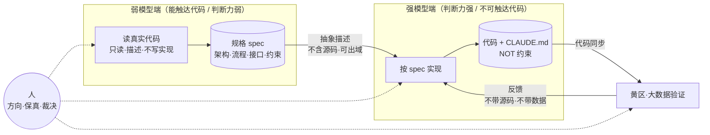
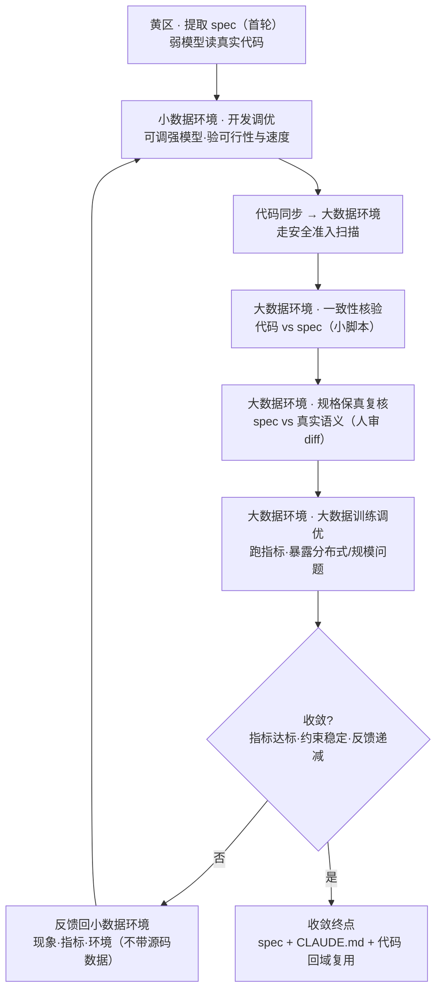

# 外部强模型重构内部代码：规格驱动 · 强弱分工 · 循环收敛

> 概述：当"能读内部代码的模型判断力不足、判断力充足的模型又读不到内部代码"时，用**规格（spec）**桥接两端——弱模型读真实代码提取规格，强模型按规格实现，人补判断缺口，约束文档沉淀防错，小数据开发→大数据验证→反馈，循环至收敛。

## 实践概览

| 问题 | 解答 |
|---|---|
| 您优秀实践的 DNA 是什么？ | **规格驱动 · 强弱分工 · 循环收敛**（详见 §范式内核）。弱模型读真实代码提取 spec，外部强模型按 spec 实现重构，CLAUDE.md 沉淀 NOT 硬约束防重复犯错，小数据开发、大数据验证、反馈迭代直到收敛；人始终负责方向与判断。 |
| AI 生成代码量有多少？ | 重构后约 **1.3 万行 Python**（39 个文件，模型/数据/训练/评估/导出全链路）由强模型按 spec 生成，含 YAML 配置体系与文档；人写的是 spec、CLAUDE.md 约束与 review 判断。 |
| 工作量收益是多大？ | **重构工作量从预估 7-8 人月降至 1 人月**。收益分两层：① 范式自身贡献——**准入**（合规墙下使强模型可用）与**保真**（精度 F1 92% 打平 baseline）；② 强模型能力产出（非范式独有，范式提供入口）——模型迭代演进（CNN+LSTM→多档 Transformer）、训练可视化调优（TensorBoard loss/acc/lr/验证指标）、数据加载 50ms→2ms（约 25×）、特征提取 120ms→5.5ms（约 22×）。 |
| AI 能力有何不足之处，您是怎么应对的？ | 四类不足及对策：① 副作用在开发规模下不可见——强模型难以预见超出当前验证范围（并发、分布式、数据规模）的副作用，小范围通过不代表真实规模可行，须走完整循环到真实规模验证；② 不会判断哪些操作不能并行——倾向给出并行化等通用优化建议，但不掌握数据一致性等"能否并行"的领域判断，由人裁决；③ 倾向过度设计——为当前不存在的扩展加抽象层（如套用设计模式），CLAUDE.md 以第一性原理/YAGNI 约束；④ 生成代码表面正确、边界易错——形状对、能跑，但边界细节易偏，重构前先建行为基线测试兜底。本质是判断力缺口——什么不能动、能否并行、要不要抽象、边界对不对，由人补齐。 |

---

## 范式内核与可推广性

将 LLM 用于公司内部代码重构时，普遍受制于同一道能力鸿沟：

- **能直接读取内部代码的模型（内网部署 / 本地可达），判断力往往不足**——架构设计、分布式调试、性能瓶颈定位、批量缺陷排查等多模块、长推理任务难以胜任；
- **判断力充足的强模型（外部前沿模型），又无法触达内部代码与数据**——受限于合规墙、网络隔离、数据不出域等约束。

本范式的核心，是以**"规格"桥接两端**：弱模型仅负责理解并提取抽象规格（不含源码、不含数据，可出域）；强模型依据规格完成实现，全程不接触内部代码与数据；由人补齐判断力缺口（方向决策、规格保真、并行性裁决）。该范式不绑定特定模型、项目或合规架构——**只要存在"弱模型可触达代码、强模型不可触达代码"的能力差，即适用**。

### 环境映射（先对齐术语再判断本组织是否适用）

本文用"黄区/蓝区"指代实例，其他组织的等价形态如下，替换即可套用：

| 本文术语 | 抽象含义 | 常见等价形态 |
|---|---|---|
| 黄区 | 模型可读代码，但合规/网络受限的环境 | 公司内网、数据不出域环境、本地部署 |
| 蓝区 | 可调前沿强模型，但不可触达内部代码的环境 | 外部开放网络、云端大模型、第三方 API |
| KIA（关键核心资产） | 仅可由内部大模型处理、不可进入本流程的最高密级 | 各组织的最高密级资产，按本组织密级表替换 |

> 合规判据：凡涉及所在组织禁止任何外部模型处理（即便仅提取规格）的密级，不进本流程。先用本组织密级表替换上表的 KIA/黄/蓝映射，再判断是否适用。

### 范式总体架构



### 四要素

| 要素 | 谁来做 | 产出 | 为什么这样切 |
|---|---|---|---|
| **分工** | 弱模型读、强模型写、人判断 | 规格 + 代码 | 代码理解属轻量任务，弱模型可胜任；实现需判断力，交由强模型；方向与保真属重量级判断，需由人承担 |
| **规格(spec)** | 弱模型从真实代码提取 | 架构/流程/接口/约束的抽象描述 | 不含源码→可出域；驱动实现；沉淀复用；模型无关（更换前沿模型仅需替换执行端） |
| **约束(CLAUDE.md)** | 人纠正 + 强模型沉淀 | 具体 NOT 规则 | 跨对话、跨区存活，防止强模型重复犯错（如"NOT Conv1d"） |
| **循环** | 小数据→大数据→反馈 | 收敛后的 spec+约束+代码 | 一次性规格必然有遗漏（版本兼容、分布式副作用、大数据瓶颈），需通过循环补齐 |

### 适用前提（四条并列，缺一不可）

> - [ ] 目标为判断力密集型重构（架构选型/分布式/性能瓶颈/批量排查等跨模块判断点 ≥2）；
> - [ ] 可触达代码的模型判断力不足（最小子任务实测无法一次完成，或公开 benchmark 与前沿差距显著）；
> - [ ] 判断力充足的模型无法触达代码（合规墙/网络隔离/数据不出域）；
> - [ ] spec 可被弱模型干净提取且不含源码与敏感数据、可出域；
> - [ ] 具备对应规模的验证环境与有领域判断力的人（能做规格保真与方向裁决）。
>
> 满足全部即可进入最小试点（见 §推广）。

---

## 循环流程：开发与验证分离

开发在可调用强模型的小数据环境进行，验证在可触达真实数据的大数据环境进行，两端以代码与反馈衔接。



**两个关键切分**：①开发（能否实现正确、能否更快）与验证（大数据上是否可行）分离；②先核验实现是否与 spec 一致（排除"代码本身未实现正确"），再上大数据（避免以错误实现空跑一轮大数据）。

**两类核验，别混为一谈**：
- **代码–spec 一致性（轻、可脚本化）**：形状、接口跑个小脚本对齐，成本远低于直接上大数据空跑一轮。
- **spec–真实 保真（重、需人）**：spec 一旦在迭代中漂移，一致性核验照样通过却失真。故每轮反馈修改 spec 后，由人复核 spec diff 是否仍忠实于原始黄区提取（及真实代码语义）。保真是命门，只能人把关。

**spec 归属随阶段切换**：首轮 spec 由黄区弱模型提取并审批出域；进入迭代后，spec 的修改在蓝区由强模型提出、人裁决，收敛版本回域复用。spec diff 回域须走与首轮相同的出域复审。

反馈包与规格同理：仅描述现象、指标与环境，不含源码与数据：

```
## 反馈（黄区 → 蓝区）
- 一致性核验：Dataset 输出 [B,157,64] 与 spec 一致；mixup 能量差实现为 2–8 dB，与 spec 的 3–10 dB 不符
- 训练问题：第 3 个 epoch 起 loss 周期性尖峰，怀疑与 schedule 重建有关
- 性能：数据加载占训练步耗时约 40%，num_workers=8 时 CPU 打满
- 环境：PyTorch 2.6，CUDA 12.4，4 卡
```

两个方向的流转均须遵循所在组织的合规流程（此为前提，非可选项）：spec 出区前经审批确认不含源码和敏感数据（模型架构与公开超参视为非敏感；数据阈值、业务规则数值、自采/购买数据标签属敏感，须脱敏或不出域），蓝区代码进黄区走安全准入扫描。

---

## 落地案例：CryDet 婴儿啼哭检测重构

本范式在 CryDet 项目上完成了从梳理、实现到黄区大数据验证的完整闭环，循环已收敛。

### 背景

原始项目为 TensorFlow + CNN+LSTM 遗留代码：单文件 940 行训练脚本、历史模型变体繁多、缺少版本注释、冗余较多。目标：迁移至 PyTorch + Transformer，以支持多端侧平台部署（不同算力/内存档位），同时提升精度/效率、降低维护成本。

### 重构前后对照

| 维度 | 原始（TF + CNN+LSTM） | 重构后（PyTorch + Transformer） |
|---|---|---|
| 代码结构 | 单文件 940 行 | model/dataset/utils/configs/scripts **五模块职责分离** |
| 模型档位 | 固定 variant、多份实现 | YAML 层参数控制，**Large/Medium/Tiny/Nano 一套代码** |
| 模型演进 | 改架构=改代码、维护多份变体 | 改架构只改 YAML 参数，新增尺寸无需改代码 |
| 训练可观测 | 无统一可视化 | **TensorBoard 记录 loss/acc/lr/验证指标**，可视化调优闭环 |
| 数据管线 | 串行、无缓存、额外磁盘读取 | LRU 内存缓存 + 线程局部 librosa/sox + 预生成噪声池 |
| 代码来源 | 人写 | **约 1.3 万行 Python（39 文件）由强模型按 spec 生成**，人写 spec/约束/判断 |

### 工作量与收益（分层归因）

> **重构工作量从预估 7-8 人月降至 1 人月**。须区分两层因果——**范式自身贡献**与**强模型能力产出（范式提供入口、非范式独有）**。

| 归因 | 收益 | 说明 |
|---|---|---|
| **范式·准入** | 在合规墙下使强模型可处理内部代码 | 跨区分工 + spec 出域使强模型"够得着"任务 |
| **范式·保真** | 精度 F1 92% 打平 baseline | spec 保留 Fbank/能量过滤/mixup 等约束 + NOT 规则防错 |
| **强模型能力** | 模型迭代演进、训练可视化调优、25×/22× 模块提速、训练 epoch 4× 提速 | 强模型生成/调优能力本身，换其他范式同样可得 |

落地指标（模块级提速测于蓝区开发机 i9-14900HX/32G/RTX 4080 Laptop 12G，开源 AudioSet 小批量；端到端精度与训练效率以黄区完整训练为准）：

| 指标 | 结果 | 测试条件 |
|---|---|---|
| 端到端精度 | **F1 保持 92%**，与原 TF+CNN+LSTM baseline 打平（验收线=不低于原模型，达标） | 黄区完整数据（AudioSet+自采+购买） |
| 数据加载 | 50ms → **2ms**，约 **25× 加速** | 蓝区开发机·小数据·稳态（不含冷启动） |
| 特征提取 | 120ms → **5.5ms**，约 **22× 加速** | 蓝区开发机·小数据 |
| 训练效率 | 单位 epoch **2h → 0.5h**，约 **4× 加速** | 黄区完整训练·单位 epoch |

> 注：模块级（数据加载/特征提取）提速不可外推为端到端训练提速；训练效率以黄区单位 epoch 为准。

精度打平即达标——92% 得以保持，效率、可维护性、模型演进与可视化调优均为净收益。

### 跨区分工映射

| 阶段 | 环境 | 执行方 | 产出 |
|---|---|---|---|
| 提取规划 | 黄区（8 卡 V100/512G 内存） | 弱模型读真实代码 | spec：流程/架构/接口/规划 |
| 实现调优 | 蓝区（开发机） | 强模型按 spec 实现 | 1.3 万行代码 + CLAUDE.md |
| 大数据验证 | 黄区 | 完整数据训练 | F1 92%、分布式/规模问题 |
| 反馈收敛 | 蓝区→黄区循环 | 强模型修复、人裁决 | 收敛 spec+约束+代码回域复用 |

---

## 关键做法

| # | 做法 | 要点 | 为什么有效 |
|---|---|---|---|
| 1 | **spec 驱动，不给模糊需求** | 把架构/接口/约束一起喂进去（示例：本项目"输入 `[B,T,F]` 不是 `[B,C,H,W]`、用 Linear projection 不用 Conv1d"；通用示例："事务接口须幂等""错误码集中枚举""不允许引入新外部依赖"） | 强模型输出质量取决于 spec 清晰度；模糊需求会使其套用训练数据中最常见的范式而偏离方向 |
| 2 | **调试喂完整上下文** | 错误日志 + 代码片段 + 运行环境一起给，不只描述症状 | 强模型能跨代码与日志追踪状态流转，但需足够输入 |
| 3 | **写完先让它自审一轮** | 代码完成主动让强模型查 bug（单次/小样本体感，未做对照测量） | 批量发现远快于逐行排查（一次列出多个含数学/逻辑错的 bug） |
| 4 | **优化定方向+出代码，验证分两段** | 强模型定位热点并出优化代码；小规模验方向、全规模验真实副作用（双环境只是其一实例，单环境可用分桶小/大数据替代） | 单模块 benchmark 看不出分布式副作用，必须跑完整流程 |
| 5 | **渐进式重构，一次一维** | 复杂模块每轮只改一个维度，每步验证再下一步（通用工程原则，本范式下尤需坚持——多维度变更叠加 AI 生成更难定位根因） | 一步到位改多维度，出问题难以定位由哪步引入 |
| 6 | **文档跟着代码一起改** | 架构变更立刻同步项目级约束文件/docs（不限于 CLAUDE.md / AGENTS.md） | 强模型跨对话不保留上下文，延后补写成本陡增 |
| 7 | **重构前先建行为基线测试** | 黄金用例/输出快照/精度基线先行，每轮循环跑回归，绿了再上大数据 | AI 生成代码常表面正确、边界错（off-by-one、padding 方向、归一化口径）；基线测试是保真的自动化兜底 |

> 强模型相对弱模型的优势所在（亦为选其完成实现的原因）：按约束生成贴合任务的骨架而非套用常见范式、跨模块读代码与日志追踪根因、以全局视角追踪训练状态流转并一次列出多个缺陷、跨多模块定位性能热点。SWE-bench（公开多文件真实 bug 修复基准）上，头部模型与小参数模型解决率长期相差数倍；长上下文抓不稳中间信息（"lost in the middle"）、长输出到一半截断后接不回，亦是社区反复讨论的老问题。**注意：SWE-bench 度量的是 bug 修复，规格驱动从零生成无等价公开基准，此处为类比推断而非直接证据。** 这些现象落在重构任务上，即弱模型难以胜任、强模型能够胜任的几类工作。

---

## 核心机制：CLAUDE.md 跨区复用约束

每次新对话，强模型自动读取 CLAUDE.md 获取固定约束（使用 codex 等工具时对应各自的 AGENTS.md，作用相同）。其中 **NOT 规则**直接防止重复犯错。本项目样例：

- 模型用 Linear projection，**NOT** Conv1d patch embedding
- 输入维度 `[B, T, F]`，T=157
- Mixup：Cry 样本混合能量差 3–10 dB，非 Cry 只能和非 Cry 混
- Audio cache 用 file mtime，**NOT** MD5 hash
- DataLoader `persistent_workers=False`（避免 DDP 死锁）

**NOT 规则分类法**（便于他团队按类别沉淀，而非照搬上述项目样例）：

| 类别 | 本项目样例 | 通用判据（你的项目该写什么） |
|---|---|---|
| 架构选型 | NOT Conv1d patch embedding | 强模型易套训练数据中常见范式而易错处 |
| 形状/维度 | `[B,T,F]`, T=157 | 全局固定常量，跨模块须一致 |
| 领域阈值 | mixup 3–10 dB | 需领域知识、强模型无从得知的数值 |
| 实现细节 | mtime NOT MD5 | 性能/正确性敏感的实现选择 |
| 运行时行为 | persistent_workers=False | 与运行环境强耦合、踩坑才知的约束 |

沉淀一条 NOT 规则的最小步骤：现象 → 根因 → NOT 表述 → 入 CLAUDE.md。该约束在蓝区沉淀并带回黄区直接复用，是循环中**唯一跨对话、跨区存活**的产物。要点：**具体的 NOT 规则远比泛泛描述有效**——`Linear projection (NOT Conv1d patch embedding)` 防止错误选择，而"使用线性投影"只描述了正确选择。

---

## 风险与规避

| 风险 | 现象 | 根因 | 对策 |
|---|---|---|---|
| **API 版本不匹配** | 代码同步过去直接报错或行为悄悄变 | 强模型默认最新 API，目标环境偏旧（如 CUDA 11.x vs 12.x、Python 3.8 vs 3.11、依赖大版本断裂） | 把框架/语言/CUDA 版本钉进 spec 和 CLAUDE.md，按目标版本写 |
| **优化小数据过、大数据失效** | "减少 DDP 同步点"、移除 `cuda.synchronize()` 小数据正常通过，大数据训练卡死 | all_gather 异步竞争、torch.compile 与 NCCL 冲突，单模块 benchmark 看不出 | 涉及并发/分布式的优化必须走完整循环到大数据验证 |
| **并行化不优于串行** | 低能量过滤改并行导致数据不一致 | 数据一致性敏感操作，强模型不会自动判断哪些能并行 | 按判别边界裁决：无共享可变状态/幂等/独立样本→可并行；共享 schedule/采样顺序/累积统计/跨样本一致性→须串行或加锁 |
| **过度设计倾向** | 给 loss 加 Strategy 模式抽象基类"便于未来扩展" | 项目只需三种 loss，工厂函数已够 | CLAUDE.md 加第一性原理/YAGNI 约束；先判断当前是否需要 |
| **生成代码表面正确、边界错** | 输出形状对、整体能跑，但 off-by-one、padding 方向、归一化口径错 | 强模型按常见范式实现，边界细节易偏 | 重构前建行为基线测试（黄金用例/快照/精度基线），每轮跑回归兜底 |

上述风险共同指向一条：**强模型的判断力缺口由人补齐**——版本钉死、并行性裁决、抽象取舍、边界核验，均为人的判断。

---

## 适用边界

**适合交由强模型的：** ①按 spec 生成模块骨架（前提：已产出清晰 spec）；②批量代码审查查 bug；③配置体系设计（dataclass+YAML）；④技术文档与可视化；⑤样板代码生成；⑥性能瓶颈分析与优化方向（只到"方向+代码"，验证交大数据）。

**能力上无法胜任、需人判断的：** ①分布式训练调试（要实际运行，大数据才暴露）；②性能优化最终验证（小数据过≠大数据过）；③业务规则细节（mixup 能量差、采样权重等需领域知识，在 spec 钉死）；④运行时版本兼容性（环境偏旧，版本人钉）；⑤重构方向决策（哪些值得动、哪些不宜动，由人判断）。

**合规上无法触达、仅限内部的：** 提取与规划阶段——要读真实代码，强模型物理上碰不到；这段弱模型本身也可胜任。

**成本边界**：本流程降低的是**模型能力的门槛**，而非**人力投入**。规格保真核对、逐轮反馈整理、方向与并行性裁决均属人的判断时间，项目越复杂、循环轮数越多，人的投入越大。它适合"内部模型确实做不动这类任务、而人有领域判断能力但缺强模型入口"的场景——以人的判断把两边的模型接起来，而非把人从流程中摘除。

**方案对照**：若强行使用内部弱模型完成本次重构，大概率在两端受阻——数百行重构代码生成中途中断、续接时上下文已丢失；架构层面则套用最常见的 ViT 范式，将 Conv1d patch embedding 错误地用于时序音频。这并非效率略低，而是能否完成的问题。

**适用规模**：本经验源自千行级、边界清晰的单项目。面对十万行级遗留代码库，提取维度增多、弱模型上下文更紧张、人工核对成本与循环轮数均会显著上升——思路不变，但建议先选取一个子系统试点跑通一轮循环，再决定是否全面铺开。

---

## 推广：最小试点与退出条件

照搬前先跑一个最小闭环，验证本组织是否适用：

- **试点规模建议**：单模块、≤2k 行、≤5 轮循环。
- **启动前置**：承接 §适用前提五项 + 一个有领域判断力的人 + 可调强模型通道 + 两个可隔离环境（或单环境分桶）。
- **每轮收敛判据**：指标达标率、约束稳定度、反馈包规模是否递减。
- **退出条件**（命中任一即放弃本范式）：连续 2 轮反馈包不收敛；spec 提取耗时 ≥ 直接手写估时的 50%；弱模型盘点输出不可信、需大量人工修正。

---

## 后续规划

- **精度由打平到反超**：以 92% 为起点，将效率提升释放的机时投入调参与消融，目标在新架构上反超 baseline。
- **多档端侧部署落地**：YAML 多档配置已就绪，下一步推进端侧平台部署。
- **资产复用至下一项目**：收敛后的 spec + CLAUDE.md 已带回黄区，同类音频/时序遗留项目重构可直接从规格提取起步，无需从零开始。

---

## 总结

跨区协作并非一次性交接，而是循环——小数据开发、大数据验证、反馈修正规格，直至收敛。本次 CryDet 的收敛终点为：工作量由预估 7-8 人月降至 1 人月，精度打平原 TF+CNN+LSTM（F1 92%，范式保真贡献），模型完成迭代演进、训练具备可视化调优闭环，训练效率与可维护性同步提升（后三者属强模型能力收益、范式提供入口）；1.3 万行代码连同收敛后的 spec + CLAUDE.md 一并带回黄区复用，后续同类任务可直接以此终点为起点。

- 范式的准入价值：合规墙下使强模型可用；保真价值：spec + NOT 规则守住精度。
- 强模型能力收益（提速、审查、演进、可视化）非范式独有，换范式同样可得——勿归因错置。
- 小数据通过不代表大数据通过；spec 保真只能人把关。
- 具体 NOT 约束比泛泛描述有效；重构范围与并行性由人裁决。

---

## 附录：黄区提取 prompt 模板

正文阐述了范式与做法，此处给出可复用的提取 prompt 模板，均按"非 KIA、只描述不贴源码"编写。流程为：先盘点、后规划；中间按维度逐个执行，将遗留代码梳理为 spec。

**模板骨架（占位符版，跨领域复用）**：

```
这是一个 [旧框架] 写的 [领域] 老项目（[架构关键词]），代码冗余多、历史变体多、没有版本注释。
请先做一次全仓库盘点，不要急着看实现细节。输出：
1. 目录结构和文件清单，按 [领域相关分类] 分类
2. 哪些文件是历史变体或死代码、哪些是当前在用的（从入口脚本和调用链反推）
3. 入口脚本和实际能跑通的调用链是什么
只盘点和归类，不贴源码，不猜实现。
```

**本项目填充示例**（[旧框架]=TensorFlow、[领域]=音频分类、[架构关键词]=CNN+LSTM）：

```
这是一个 TensorFlow 写的音频分类老项目（CNN+LSTM），代码冗余多、历史模型变体多、没有版本注释。
请先做一次全仓库盘点，不要急着看实现细节。输出：
1. 目录结构和文件清单，按"数据/模型/训练/评估/部署/工具脚本/疑似废弃"分类
2. 哪些文件是历史变体或死代码（入口引用不到、import 不到）、哪些是当前在用的
   （从入口脚本和调用链反推——因为没有版本注释，只能靠引用关系判断）
3. 入口脚本和实际能跑通的调用链是什么
只盘点和归类，不贴源码，不猜实现。
```

重构规划（核心 spec，本项目示例）：

```
原始是 TF + CNN+LSTM，冗余多、历史模型多、无版本信息。重构目标：迁移到 PyTorch + Transformer，
便于多端侧平台部署（不同算力/内存档位）。请产出重构 spec，包含：
1. 目标架构：Transformer 编码器 + 分类头，输入 [B,T,F]，Linear projection（不用 Conv1d patch embedding），
   模型大小用层参数（d_model/n_layers）控制以适配多档端侧
2. 迁移映射：原 CNN 局部特征 → Linear projection + encoder，原 LSTM 时序建模 → encoder 自注意力；
   哪些原逻辑保留（特征方案、数据约束），哪些丢弃（历史变体、冗余）
3. 分步规划：迁数据 pipeline（TF→PyTorch）→ 迁模型 → 迁训练循环 → 补多档端侧配置，
   每步标验收标准（输出形状对齐、精度不低于原 CNN+LSTM baseline）
4. 必须守住的约束：特征方案不变（Fbank 参数）、数据约束不变（能量过滤、正负比例）、
   精度不低于原模型 baseline
只产出 spec 和规划，不写实现代码。
```

按维度提取的四个 prompt（模式相同，每个维度产出一份输出，以下为本项目示例）：

模型架构提取（CNN+LSTM）：

```
从上一步盘点出"当前在用"的模型定义，还原 CNN+LSTM 的网络结构。
输出从输入到分类头的逐层描述，每层标明：类型（Conv/Pool/LSTM/FC）、输入输出张量形状
（注意 TF 的记法）、参数量、是否带 BN/Dropout。
重点说清 CNN 部分和 LSTM 部分怎么衔接（CNN 输出怎么 reshape 进 LSTM）、时序维度 T、特征维 F 各是多少。
只描述结构，不贴源码。
```

数据 pipeline 提取（TF）：

```
还原从音频文件到训练 batch 的完整 pipeline，基于 TF 实现（先说明用的是 tf.data / placeholder / feed_dict 哪种）。
输出数据流图：文件读取→分帧/切片→特征提取（Fbank/MFCC？参数多少）→增强→batch。
每步标明张量形状、采样规则、哪些状态在 epoch 间重建。
标出关键约束：cry 样本能量过滤阈值、正负样本比例。只描述，不贴源码。
```

训练逻辑提取（TF）：

```
还原训练逻辑：用的是 tf.session / Estimator / Keras 哪套？画出训练步的状态流转：
前向→loss→梯度更新→（如有）调度器→保存→验证。重点：loss 组成、优化器和初始 lr、
lr 有没有调度、有没有 EMA、checkpoint 存了哪些、resume 怎么恢复（还是根本没做）。
指出和"无版本信息"相关的隐患（哪些状态没存、哪些 baseline 没记录）。
```

冗余与历史模型梳理：

```
项目里有多个历史模型变体和重复逻辑。请梳理：
1. 列出所有模型变体（按文件/类名），标注差异（层数？通道？带不带 LSTM？）和推测的演进顺序
   （没有版本就靠调用关系、注释、命名猜）
2. 列出重复逻辑（多处特征提取、多处数据加载），标出哪些当前在用、哪些是冗余
3. 分"可安全删除"和"需确认后再删"两类
输出为表格，便于重构时清理。
```

数据读取维度 spec 节选（已脱敏，本项目样例，用以直观呈现规格粒度——含形状、规则与参数含义，但不含任何源码与敏感数值）：

```
## 数据读取 spec（节选）
- 输入：单声道音频，重采样到 16kHz，切 5 秒定长段（不足右补零，长音频随机切片）
- 特征：FBank，n_mels=64，n_fft=1024，hop_length=512，fmin=250Hz，fmax=8000Hz
  → 输出张量 [T=157, F=64]（T=157 对应 5s @16kHz / hop 512）
- 能量过滤：cry 标签样本平均能量低于阈值则丢弃（阈值数值属敏感信息，以约束形式描述：
  "过滤后保留的样本应为人耳可辨识的啼哭"）
- 增强规则：cry 样本可与 cry 样本 mixup，混入样本能量须低于原样本 3–10 dB；
  非 cry 只能与非 cry 混
- 采样：每 epoch 重建切片 schedule，cry / 非 cry 按目标比例平衡采样
- collate：stack 成 [B, 157, 64]；标签映射 cry=1，other=0
```
